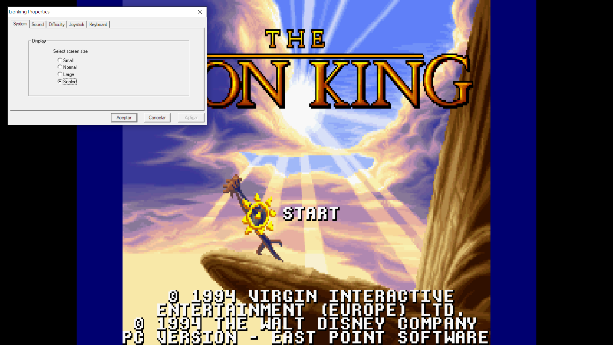

# The Lion King (1997) Windows Fix

An unofficial compatibility fix for the Windows version of *Disney's The Lion
King* included in the European *Disney's Classic Video Games* collection
(1997).

It makes the original game run cleanly on modern Windows while preserving its
art, audio and native Win32 code. No game files are included.

## What it fixes

- removes the false “must run in at least 256 colours” rejection;
- repairs the EPFS file-open check used during startup;
- replaces an obsolete BIOS clock call and four privileged CPU instructions;
- renders the 8-bit DirectDraw game correctly in borderless fullscreen;
- preserves the intended 4:3 image and limits presentation to 60 FPS;
- keeps music and sound working from a portable folder;
- provides stable taskbar, Alt+Tab and live-preview behaviour;
- exposes the original Properties panel with `F2`;
- makes its Keyboard and Joystick tabs safe on 64-bit Windows;
- restores a proper English exit confirmation with `Esc`;
- hides the permanent busy cursor during play and restores it for dialogs;
- launches through a temporary short path to avoid the original MIDI command
  buffer overflowing on long modern folder names.

## Installation

1. Install or copy the original European Windows game from your own disc.
2. Download the latest release ZIP.
3. Extract every file from its `patch` folder beside `LIONW.EXE`.
4. Run `Install patch.cmd` once.
5. From then on, start the game with `Play Lion King.exe`.

The installer accepts only the exact supported executable, verifies every
patch component, creates `LIONW.EXE.gamevault-original`, applies the known byte
changes and verifies the finished result. An unknown executable is never
modified.

To undo the executable changes, run `Restore original.cmd`. Compatibility
files are deliberately left in place rather than silently deleted.

## Supported executable

- Original SHA-256: `3E99DC48A4B347833E3857A13E0635AB9C5A262BBCD2DBB5304A7BBE0E45DEF3`
- Patched SHA-256: `AD28370116F86CEAAB87D77B66533018716CACB6E3E010ED63E3A053BA327EC8`

If your hash differs, stop. It may be another legitimate edition, but this
release has not been proven safe for it.

## Using the game

- `F2`: open the original Properties panel.
- `Esc`: pause and ask whether to exit.
- `Alt+Tab`: switch normally between the game and other applications.

Difficulty and remapped keyboard/joystick controls work during the current
session. This 1997 release recreates its default bindings on every launch, so
custom bindings are not persistent.

One small Windows quirk remains: after clicking the taskbar icon, the taskbar
can occasionally stay visible until the game regains focus. Pressing
`Alt+Tab` away and back restores the borderless presentation.

## What the download contains

- `ddraw.dll`: the open-source GameVaultDraw compatibility layer;
- `GameVaultDraw.ini`: borderless 4:3 and 60 FPS defaults;
- `Play Lion King.exe`: a native, console-free short-path launcher;
- safe install and restore scripts.

It does **not** contain `LIONW.EXE`, music, artwork, archives, disc images or
any other proprietary game data. You must supply your own legitimate copy.

## Technical information

The concise explanation is in [the technical report](docs/TECHNICAL_REPORT.es.md).
Exact build and hash instructions are in
[REPRODUCIBILITY.md](docs/REPRODUCIBILITY.md), and the completed test matrix is
in [VALIDATION.md](docs/VALIDATION.md).

The source code is under `src/`. The machine-readable executable recipe is
under `recipes/`.

## Compatibility and support

Version 1.0.0 was validated on Windows 10 22H2 with the opening sequence, title
screen, gameplay through multiple lives, music, sound, game over, Properties,
input remapping, pause/exit, taskbar, Alt+Tab and DWM previews.

Please report another edition by opening an issue with its SHA-256 and observed
error. Do not upload copyrighted game files.

## License and trademarks

The original compatibility code and scripts in this repository are available
under the [MIT License](LICENSE).

Disney, *The Lion King* and all original game assets belong to their respective
owners. This preservation project is unofficial, non-commercial and is not
affiliated with or endorsed by Disney.
